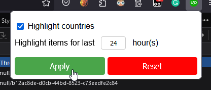

# Simple web extension to highlight actual proposals on upwork portal.

## Links

### Firefox

- [Your first extension - Mozilla | MDN](https://developer.mozilla.org/en-US/docs/Mozilla/Add-ons/WebExtensions/Your_first_WebExtension)
- [Your second extension - Mozilla | MDN](https://developer.mozilla.org/en-US/docs/Mozilla/Add-ons/WebExtensions/Your_second_WebExtension)

- [mdn/webextensions-examples: Example Firefox add-ons created using the WebExtensions API](https://github.com/mdn/webextensions-examples/tree/main)

### Chrome

- [Chrome Extensions getting started guides - Chrome for Developers](https://developer.chrome.com/docs/extensions/mv3/getstarted/)

### Cross-browser

- [Build a cross-browser extension - Mozilla | MDN](https://developer.mozilla.org/en-US/docs/Mozilla/Add-ons/WebExtensions/Build_a_cross_browser_extension)

### Debugging

- [Debugging | Firefox Extension Workshop](https://extensionworkshop.com/documentation/develop/debugging/)

### Samples

- [webextensions-examples/favourite-colour/options.js](https://github.com/mdn/webextensions-examples/blob/main/favourite-colour/options.js)
- [StorageArea.set() - Mozilla | MDN](https://developer.mozilla.org/en-US/docs/Mozilla/Add-ons/WebExtensions/API/storage/StorageArea/set)

### Code

- [sinanbekar/browser-extension-react-typescript-starter: 🚀 React & TypeScript Starter for developing web extensions with hot reload!](https://github.com/sinanbekar/browser-extension-react-typescript-starter)
- [Creating a Chrome extension with React and TypeScript - LogRocket Blog](https://blog.logrocket.com/creating-chrome-extension-react-typescript/)

Types (doesn't work):

- [typescript - is there any @types for interoperable browser extension object? - Stack Overflow](https://stackoverflow.com/questions/44204499/is-there-any-types-for-interoperable-browser-extension-object)

### Docs

- [storage - Mozilla | MDN](https://developer.mozilla.org/en-US/docs/Mozilla/Add-ons/WebExtensions/API/storage)

## Work with temporary loaded plugin

In firefox, open system pages:

- `about:debugging`
- `about:debugging#/runtime/this-firefox`

## Screenshots

Initial screen:

<!--
@changed 2023.10.30, 00:22
vim:ic
-->
